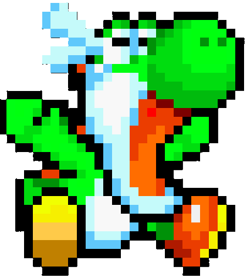

# 🦖 Dino Runner · C++ + SFML 3.0.1



Este proyecto es un videojuego tipo *endless runner* desarrollado en C++ utilizando la biblioteca [SFML 3.0.1](https://www.sfml-dev.org/). El jugador controla un dinosaurio que debe esquivar obstáculos mientras corre sin fin, intentando lograr la máxima puntuación posible. Es una versión inspirada en el famoso "Dino" de Google Chrome, con gráficos, sonidos y animaciones personalizadas.

## 🗂️ Estructura del Proyecto

```
Proyecto-1/
├── makefile
├── README.md
├── .vscode/
│   ├── c_cpp_properties.json
│   ├── launch.json
│   ├── settings.json
│   └── task.json
├── assets/
│   ├── audio/
│   │   ├── gameover.mp3
│   │   ├── jump.mp3
│   │   └── melody.mp3
│   ├── fonts/
│   │   └── font.ttf
│   ├── image/
│   │   ├── cloud.jpg
│   │   ├── ghost.png
│   │   ├── ground.png
│   │   ├── obstacle.png
│   │   ├── title.png
│   │   └── dinosaur/
│   │       ├── dino 1.png
│   │       ├── dino 2.png
│   │       ├── dino 3.png
│   │       ├── dino 4.png
│   │       ├── dino 5.png
│   │       ├── dino 6.png
│   │       ├── dino down.png
│   │       └── dino loose.png
├── bin/
│   └── main
├── docs/
│   └── diagrama.puml
├── include/
│   ├── Cloud.hpp
│   ├── Dino.hpp
│   ├── Ghost.hpp
│   ├── Ground.hpp
│   └── Obstacle.hpp
└── src/
    └── main.cpp
```

## 📦 Dependencias

- [SFML](https://www.sfml-dev.org/) (Simple and Fast Multimedia Library)

## ⚙️ Instalación

1. Clona este repositorio:
   ```bash
   git clone <URL-del-repositorio>
   ```
2. Asegúrate de tener SFML instalado en tu sistema.
3. Compila el proyecto utilizando el `makefile`:
   ```bash
   make main
   ```

## ▶️ Ejecución

Ejecuta el archivo binario generado:

```bash
./bin/main
```

## 🎮 Controles

- **Espacio**: Saltar o reiniciar el juego
- **Flecha abajo**: Agacharse 


## 📄 Licencia

Este proyecto está bajo la licencia MIT.

---
